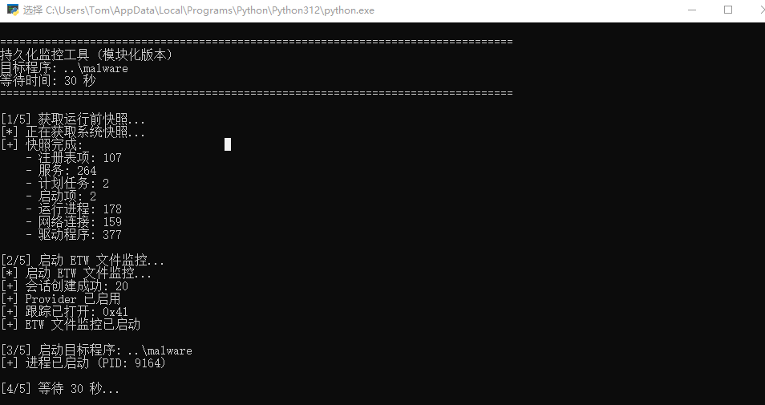

# PersistenceMonitor

[English](README_EN.md) | 中文

Windows 持久化机制监控工具，专为恶意软件分析和安全研究设计。通过前后快照对比和 ETW 文件事件追踪，全面检测程序的持久化行为。  
样本来源为：[全网首发！银狐团伙2026年开年最新黑科技深度拆解！](https://mp.weixin.qq.com/s/oXPGsrn2u84IVA3aGWXL7A)

## 亮点: 清晰易读的报告格式

本工具生成的报告采用结构化纯文本格式，**人类分析师和 AI Agent 都能高效使用**：

- **纯文本格式**：无需专用工具，任何文本编辑器即可打开查看
- **分类清晰**：按 `ADDED_*`、`REMOVED_*`、`MODIFIED_*` 分类组织，快速定位关注点
- **风险标注**：高风险项有明确标记，便于优先处理
- **上下文完整**：报告包含充足的上下文信息，支持深度分析

### 使用示例



*运行监控脚本，自动捕获目标程序的持久化行为*

**人工分析**：直接阅读报告文件，根据分类和风险标记进行研判

**AI Agent 辅助分析**：报告格式对 Agent 友好，可将报告目录交给 AI Agent 自动分析


*AI Agent 读取报告后自动识别恶意行为模式并给出专业研判*

> `example/` 目录包含完整的使用示例：
> - `persistence_report_malware_20260202_165357/` - 上述截图中工具的实际运行结果
> - `cloudflare.mem` - AI Agent 分析上述报告的完整对话记录
> - `Report.md` - Agent 最终输出的分析报告

## 功能特性

- **前后快照对比**：在运行目标程序前后捕获系统状态并对比差异
- **ETW 文件追踪**：使用 ETW 实时捕获文件系统事件，记录程序的文件操作行为
- **全面的持久化检测**：
  - 注册表自启动项（Run、RunOnce、Winlogon、IFEO 等）
  - Windows 服务
  - 计划任务
  - 启动文件夹
  - WMI 事件订阅
  - BITS 后台任务
  - PowerShell 配置文件
  - 内核驱动
- **网络连接监控**：追踪目标程序建立的新网络连接
- **进程监控**：检测新创建的进程
- **详细报告**：生成包含风险评估的综合报告

## 系统要求

- Windows 10/11 或 Windows Server 2016+
- Python 3.8+
- 管理员权限（ETW 必需）

## 安装

```bash
git clone https://github.com/miunasu/PersistenceMonitor.git
cd PersistenceMonitor
```

无需额外依赖 - 仅使用 Python 标准库和 Windows API。

## 使用方法

```bash
# 基本用法
python -m etw_monitor.main <目标程序> [等待秒数]

# 示例：监控可疑文件 60 秒
python -m etw_monitor.main suspicious.exe 60

# 默认等待时间为 30 秒
python -m etw_monitor.main malware_sample.exe
```

工具执行流程：
1. 获取系统快照（注册表、服务、任务等）
2. 启动 ETW 文件监控
3. 执行目标程序
4. 等待指定时间
5. 停止监控并获取新快照
6. 对比快照并生成报告

## 输出结果

报告保存在 `persistence_report_<文件名>_<时间戳>/` 目录下，包含：

- `00_SUMMARY.txt` - 总览和风险评估
- `ADDED_*.txt` - 新增的持久化机制
- `REMOVED_*.txt` - 删除的项目
- `MODIFIED_*.txt` - 修改的项目

## 高风险文件扩展名

工具会标记以下扩展名为高风险：
`.exe`、`.dll`、`.sys`、`.bat`、`.cmd`、`.ps1`、`.vbs`、`.js`、`.jar`、`.msi`、`.scr`、`.com`、`.pif`、`.cpl`、`.hta`、`.wsf`、`.vbe`、`.jse`

## 局限性

- 需要管理员权限才能使用完整的 ETW 功能
- 仅支持 Windows（使用 Windows 特定 API）
- 某些持久化机制可能需要额外的检测方法

## 使用场景

- **恶意软件分析**：了解恶意软件如何建立持久化
- **安全研究**：研究持久化技术
- **应急响应**：识别受感染系统上的持久化机制
- **红队测试**：验证持久化检测能力

## 许可证

GPL-3.0 License

## 免责声明

本工具仅用于安全研究和授权测试。在分析不属于您的软件或系统之前，请务必获得适当的授权。